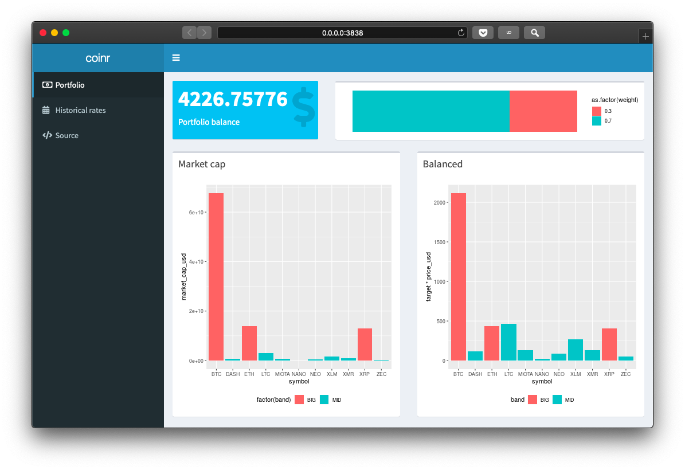

coinr
=====

**coinr** is cryptocurrency portfolio manager, written in R and deployed as a
Shiny dashboard.

Usage
-----

	docker-compose up

Todo
----

- [ ] add portfolio rebalancing code to the dashboard
- [ ] save portfolio snapshots to external data store (SQLite)
- [ ] implement historical API
- [ ] separate dev from prod Docker image
